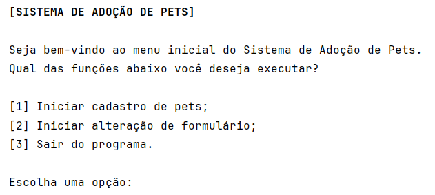

# 🐾 Pet Adoption System

A command-line pet registration system built in Java, applying Object-Oriented Programming concepts, a layered architecture, and good coding practices.

The system allows an animal shelter manager to register, list, search, update, and delete pets available for adoption, with data persisted in text files. It also supports a dynamic form: custom questions can be added, edited, and removed beyond the 7 default ones, with their answers stored alongside each pet's registration.

## 🔎 Preview



## 📌 Features

- Register new pets, with validation for name, type, biological sex, address, age, weight, and race;
- Answer custom extra questions during registration, if any have been added to the form;
- List all registered pets;
- Search pets by up to 3 combined criteria (type is mandatory, plus up to 2 additional ones), ignoring accents and case;
- Update any pet data except type and biological sex, including answers to extra questions;
- Delete a pet's registration, with user confirmation;
- Manage the registration form: add, edit, and remove extra questions (the original 7 questions are protected and cannot be changed).

## 💻 Technologies

- Java 17;
- No external dependencies (no Maven/Gradle).

## 📄 Sample entry file – `form.txt`
```
1 – Qual o nome e sobrenome do pet?
2 – Qual o tipo do pet (cachorro ou gato)?
3 – Qual o sexo biológico do animal?
4 – Qual o endereço e bairro em que ele foi encontrado?
5 – Qual a idade aproximada do pet?
6 – Qual o peso (em kg) aproximado do pet?
7 – Qual a raça do pet?
```

> ⚠️ The application reads this file directly – **do not hardcode questions**.

## ⚙️ How to run

1. Clone the repository;
2. Open the project in your IDE of choice (e.g. IntelliJ IDEA);
3. Run the `Main` class, located at `src/br/com/florentino/Main.java`.

Registered pets are saved to the `registeredPets/` folder, automatically created in the project root at runtime. Form questions are read from and written to `resources/form.txt`.

## 🚀 Project structure

```
src/br/com/florentino/
├── entity/         → Pet, Address
├── enums/          → Type, BiologicalSex
├── validator/      → PetValidator
├── exceptions/     → custom validation exceptions
├── repository/     → PetRepository, FormRepository (file persistence)
├── services/       → PetService, FormService, MenuService (business rules and flow)
└── utils/          → StringFormatter, NumberParser, Constants
```

## 📋 Future implementations

- [ ] Search by registration date (level 2 optional rule);
- [ ] Highlight the searched term in the results (level 2 optional rule).

## 🤝 Credits

This project is based on the [desafioCadastro](https://github.com/karilho/desafioCadastro) challenge, created by Lucas Carrilho.